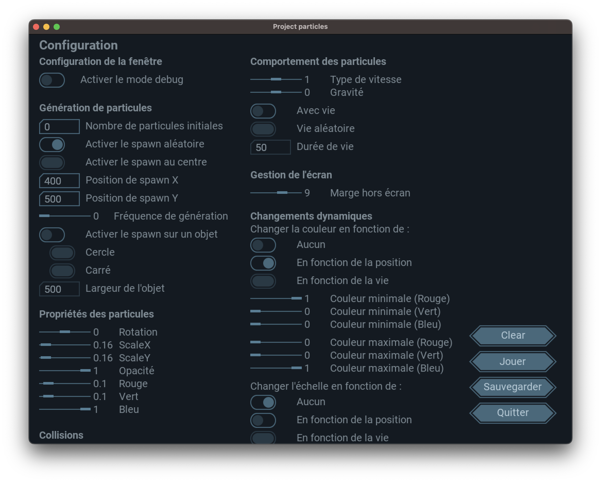

# Particules
Particule est un projet créé en Go (golang) pour le cours d'initiation au développement à <a href="https://iutnantes.univ-nantes.fr">l'IUT de Nantes</a>.

## 🏁 Pour commencer
### Pré-requis
- Go <a href="https://go.dev/doc/install">(Lien vers l'instalation de Go)</a>
- Git <a href="https://git-scm.com/book/fr/v2/Démarrage-rapide-Installation-de-Git">(Lien vers l'instalation de Git)</a>

### Installation
1. Cloner le projet
```bash
git clone https://gitlab.univ-nantes.fr/particules/particules.git
```
2. Se déplacer dans le dossier du projet
```bash
cd particules
```
3. Compiler le projet
```bash
go build
```
4. Lancer le projet
```bash
./particules
```
(ou ```particules.exe``` sur Windows)

## 🔧 Configuration
Dans ce projet, il se trouve un fichier intitulé ```config.json``` qui permet de configurer le projet.

### Configuration de la fenêtre
```json
	"WindowTitle": "Project particles",
	"WindowSizeX": 800,
	"WindowSizeY": 600,
	"ParticleImage": "assets/particle.png",
````
- ```WindowTitle``` : Titre de la fenêtre
- ```WindowSizeX``` : Largeur de la fenêtre
- ```WindowSizeY``` : Hauteur de la fenêtre
- ```ParticleImage``` : Chemin vers l'image de la particule
### Debug
```json
	"Debug": bool,
````
- ```Debug``` : Affiche ou non les informations de debug
### Génération des particules
```json
	"InitNumParticles": int,
	"RandomSpawn": bool,
	"SpanwCenter": bool,
	"SpawnX": int,
	"SpawnY": int,
	"SpawnRate": float64,
	"SpawnOnAnObject" : bool,
````
- ```InitNumParticles``` : Nombre de particules à générer au lancement du programme
- ```RandomSpawn``` : Si ```true```, les particules sont générées aléatoirement sur la fenêtre, sinon elles sont générées à la position ```SpawnX``` et ```SpawnY```
- ```SpawnX``` : Position X de la génération des particules
- ```SpawnY``` : Position Y de la génération des particules
- ```SpawnRate``` : Nombre de particules générées par seconde
- ```SpawnOnAnObject``` : Si ```true```, les particules sont générées sur un objet
### Generation sur un objet
```json
	"SpawnObject" string,
	"SpawnObjectWidth" : int,
````
- ```SpawnObject``` : Type d'objet
	- ```circle``` : Cercle
	- ```square``` : Carré

- ```SpawnObjectWidth``` : Largeur de l'objet

### Propriétés des particules
```json
	"Rotation":float64,
	"ScaleX": float64,
	"ScaleY": float64,
	"Opacity": float64,
	"ColorRed": float64,
	"ColorGreen": float64,
	"ColorBlue": float64,
````
- ```Rotation``` : Rotation de la particule
- ```ScaleX``` : Taille de la particule en X
- ```ScaleY``` : Taille de la particule en Y
- ```Opacity``` : Opacité de la particule
- ```ColorRed``` : Couleur de la particule en rouge (1 => 255 en RGB)
- ```ColorGreen``` : Couleur de la particule en vert (1 => 255 en RGB)
- ```ColorBlue``` : Couleur de la particule en bleu (1 => 255 en RGB)
### Comportement de la particule 
```json
	"SpeedType" : int,
	"KillParticlesOutside" : bool,
	"Gravity" : float64,
	"MarginOutsideScreen": int,
	"HaveLife": bool,
	"RandomLife": bool,
	"Life": int
````
- ```SpeedType``` : Type de vitesse de la particule
    - -1 : Vitesse aléatoire
	- 0 : Pas de vitesse
	- 1 : Vitesse faible
    - 2 : Vitesse moyenne
    - 3 : Vitesse forte
- ```KillParticlesOutside``` : Si ```true```, les particules sont supprimées si elles sortent de l'écran
- ```Gravity``` : Force de la gravité (de -1 à 1)
- ```MarginOutsideScreen``` : Marge de la fenêtre pour la suppression des particules
- ```HaveLife``` : Si ```true```, les particules ont une durée de vie
- ```RandomLife``` : Si ```true```, la durée de vie des particules est aléatoire
- ```Life``` : Durée de vie des particules (si ```RandomLife``` est ```false```)

### Changement dynamique des particules
```json
	"ChangeColorAccordingTo": int,
	"MinColorRed": float64,
	"MinColorGreen": float64,
	"MinColorBlue": float64,
	"MaxColorRed": float64,
	"MaxColorGreen": float64,
	"MaxColorBlue": float64,

	"ChangeScaleAccordingTo": int,
	"ChangeRotationAccordingTo": int,
	"ChangeOpacityAccordingTo": int,
````
- ```ChangeColorAccordingTo``` : Changement de la couleur des particules
	- 0 : Aucun changement
	- 1 : Changement de la couleur en fonction de la vitesse
	- 2 : Changement de la couleur en fonction de la durée de vie
- ```MinColorRed``` ```MinColorGreen``` ```MinColorBlue``` : Couleur minimale des particules
- ```MaxColorRed``` ```MaxColorGreen``` ```MaxColorBlue``` : Couleur maximale des particules
- ```ChangeScaleAccordingTo``` : Changement de la taille des particules
	- 0 : Aucun changement
	- 1 : Changement de la taille en fonction de la vitesse
	- 2 : Changement de la taille en fonction de la durée de vie
- ```ChangeRotationAccordingTo``` : Changement de la rotation des particules
	- 0 : Aucun changement
	- 1 : Changement de la rotation en fonction de la vitesse
	- 2 : Changement de la rotation en fonction de la durée de vie
- ```ChangeOpacityAccordingTo``` : Changement de l'opacité des particules
	- 0 : Aucun changement
	- 1 : Changement de l'opacité en fonction de la vitesse
	- 2 : Changement de l'opacité en fonction de la durée de vie

### Collision 
```json
	"Collision": bool,
	"CollisionAmongParticle": bool,
	"CollisionWithWall": bool,
```
- ```Collision``` : Si ```true```, les particules peuvent entrer en collision
- ```CollisionAmongParticle``` : Si ```true```, les particules peuvent entrer en collision entre elles
- ```CollisionWithWall``` : Si ```true```, les particules peuvent entrer en collision avec les murs
### Interaction avec l'utilisateur 
```json
	"Interaction": bool,
	"FollowMouse": bool
```
- ```Interaction``` : Si ```true```, les particules peuvent être déplacées par l'utilisateur avec le clavier. (Touches : flèches directionnelles)
- ```FollowMouse``` : Si ```true```, les particules suivent la souris

## 🖥️ Interface de configuration

</img>
</br>
Un interface a été mis en place pour aider l'utilisateur à trouver une configuration parfaite.
</br>
Cette pages possède 3 boutons :
- ```Jouer``` : Permet d'accéder aux particules
- ```Sauvegarder``` : Permet de sauvegarder la configuration dans le fichier JSON
- ```Quitter``` : Permet de quitter l'application
```
💡 Astuces : 
   La touche ENTER permet d'accéder aux particules. 
   La touche ESCAPE permet de revenir à l'interface.
```

```
💡 Astuce : Vous pouvez sélectionner plusieurs sliders et les déplacer en même temps. 
```

## ⌨️ Credits
Ce projet a été réalisé par :
- Alexys G : [@E226772R](https://gitlab.univ-nantes.fr/E226772R) 
- Floran M : [@E226752U](https://gitlab.univ-nantes.fr/E226752U)

Ce projet a été réalisé dans le cadre d'une SAE en développement Go (golang) de l'Université de Nantes.
